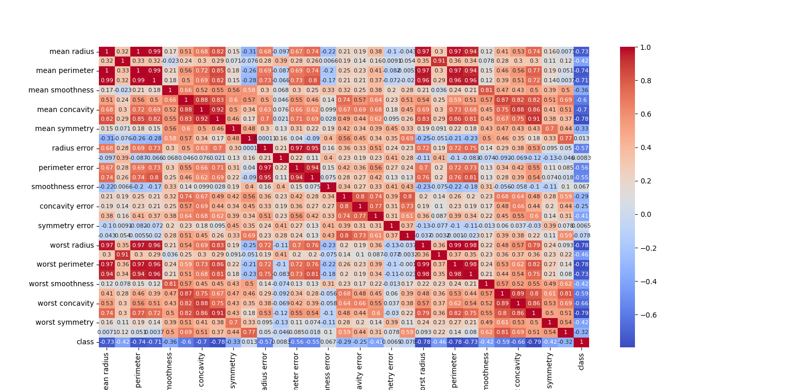

# Breast Cancer Detection
Uses the python sklearn library to develop a correlation heat_map for prediction of breast cancer depending on various features.

## Introduction
Imports all the necessary functions from the sklearn library

```python
from sklearn.datasets import load_breast_cancer
from sklearn.model_selection import train_test_split
from sklearn.neighbors import KNeighborsClassifier
```

Importing all the of the requires libraries

```python
import numpy as np
import pandas as pd
import seaborn as sns
import matplotlib.pyplot as plt
```

## Preparation
Loading the dataset and setup axes

```python
data = load_breast_cancer()
X = data['data']
Y = data['target']
```

Split the dataset amongst the training and testing groups

```python
X_train, X_test, Y_train, Y_test = train_test_split(X, Y, test_size = 0.2)
```

## Modelling
Utilise the K-Nearest-Neighbors (KNN) Classifier ALgorithm to model the data 
```python
clf = KNeighborsClassifier()
clf.fit(X_train, Y_train)
```

## Testing
Gives the accuracy of our model
```python
print(clf.score(X_test,Y_test))
```

    0.9035087719298246
    
## Visualization
Prepare data to visualize

```python
column_data = np.concatenate([data['data'], data['target'][:, None]], axis=1)
column_names = np.concatenate([data['feature_names'], ["class"] ])
```


```python
df =  pd.DataFrame(column_data,columns = column_names)
```

Creates a heatmap to visualise the correlations between the features of the dataset

```python
sns.heatmap(df.corr(), cmap = "coolwarm", annot= True, annot_kws = {"fontsize":8})
```


    <AxesSubplot:>


    

    
